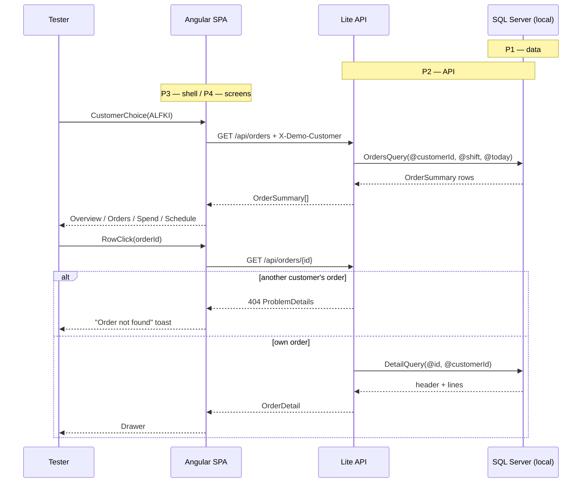
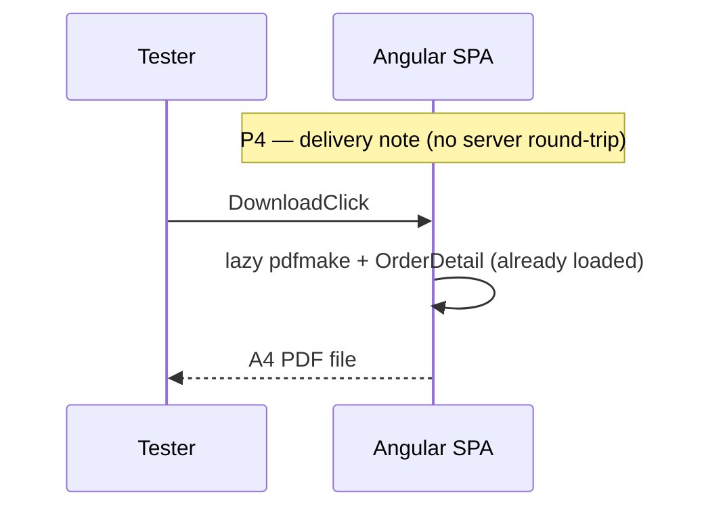
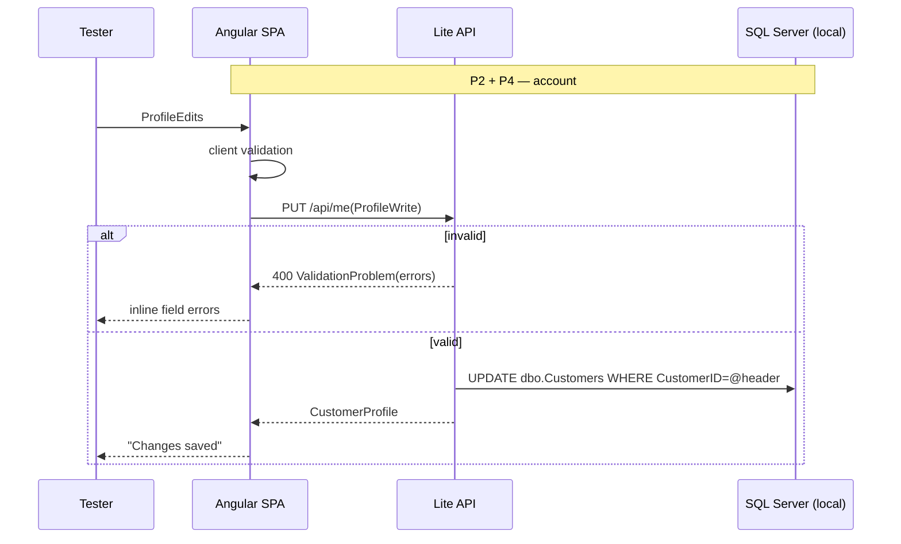

# portal-lite — spec

```yaml
spec: Northwind Customer Portal — Lite (demo build)
context:
  stack: Angular 22 SPA + .NET 10 minimal API + local SQL Server Northwind (throwaway copy)
  goal: visible quality for non-technical judges; invisible architecture deferred to roadmap
  startup: "two terminals: dotnet run (API :5080) and ng serve (SPA :4200, proxy /api -> :5080)"
dependencies:  # all MIT/Apache/OFL — no commercial licence anywhere
  web: [ "@angular/* 22", "@angular/material + cdk 22 (MIT)", "ag-grid-community + ag-grid-angular 35 (MIT)",
         "echarts + ngx-echarts (Apache-2.0)", "@fullcalendar/angular 6.1.x (MIT)",
         "pdfmake (MIT, lazy-loaded)", "@fontsource: big-shoulders-display, ibm-plex-sans, ibm-plex-mono (OFL)" ]
  api: [ "Dapper (Apache-2.0)", "Microsoft.Data.SqlClient (MIT)" ]
  rejected_for_lite: [ Tailwind (overlaps tokens), NSwag, FluentValidation, JWT stack — see roadmap ]

---
phase: P1
component: Local Northwind + query file
requirements:
  - restore: stock Northwind (Microsoft sql-server-samples instnwnd.sql) on the local instance if absent
  - write: db/portal-lite.sql holding the 5 queries the API will run, parameterised by @customerId, @shift, @today
  - derive: status (Shipped | Awaiting dispatch | Late) and order total (sum of UnitPrice*Quantity*(1-Discount)) in SQL
acceptance:
  - given @customerId='ALFKI', when orders query run, then 6 rows with shifted dates, status and total
  - given @customerId='ALFKI' and an OrderID belonging to another customer, when detail query run, then 0 rows
  - given @customerId='FISSA', when orders query run, then 0 rows (empty-state fixture)
  - given the orders query across all customers, then at least one row of each status exists
proof:
  start: "already in place once restored; open SSMS / Azure Data Studio"
  drive: "run each query in db/portal-lite.sql with the parameters above"
  observe: "row counts and statuses as stated; shifted dates fall around 09/2026"
  proves: "data and derived status are right before any code depends on them"

---
phase: P2
component: Lite API
requirements:
  - endpoints:
      GET  /api/customers?search=   -> [{ id, companyName, city, country }]   # max 20, anonymous
      GET  /api/me                  -> CustomerProfile
      PUT  /api/me                  -> CustomerProfile | 400 ValidationProblem
      GET  /api/orders              -> [OrderSummary]  # id, orderedOn, shippedOn?, dueOn, status, itemCount, total, shipTo
      GET  /api/orders/{id}         -> OrderDetail | 404  # header, shipTo, lines[], subtotal, freight, total
  - identity: header X-Demo-Customer on every call except /api/customers; missing -> 401 ProblemDetails
  - scoping: customerId taken from the header only, never from body or route
  - validation: PUT /api/me — contactName required ≤30; phone/fax /^[0-9 +()\-.]{0,24}$/; postalCode ≤10; country required
  - config: ConnectionStrings:Northwind via user-secrets; Portal:DateShiftMonths optional override
  - layout: src/PortalLite.Api — Program.cs + Endpoints/{Customers,Me,Orders}Endpoints.cs + Data/*Queries.cs, one type per file
acceptance:
  - given X-Demo-Customer=ALFKI, when GET /api/orders, then 6 summaries, each with status and total
  - given X-Demo-Customer=ALFKI, when GET /api/orders/{another customer's id}, then 404
  - given no header, when GET /api/me, then 401
  - given PUT /api/me with phone "abc", then 400 with an errors.phone entry
  - given a valid PUT then GET /api/me, then the change is returned
proof:
  start: "dotnet run --project src/PortalLite.Api"
  drive: "run api.http (VS / Rider / VS Code REST client) top to bottom"
  observe: "each response matches the acceptance lines"
  proves: "API serves the phase-1 data with correct scoping"

---
phase: P3
component: Design system and app shell (no API calls)
requirements:
  - tokens: src/styles/tokens.css — every colour, space (4/8 scale), radius, type step; M3 --mat-sys-* mapped
  - themes: 3 brand presets x light/dark as token overrides on [data-brand][data-theme]
  - shell: side rail ≥1024px, top bar, bottom nav <720px; routes stubbed with page headers
  - shared: status-chip, voyage-line (mini|large|hero), skeleton, empty-state, page-header, order-drawer shell
  - route: /styleguide — renders every shared component in every state
acceptance:
  - given the Brand preview menu, when a preset chosen, then colours, wordmark and radius change with no reload
  - given dark mode, then no pure #000/#FFF and all text ≥4.5:1 (checked in each preset with devtools)
  - given 360px viewport, then no horizontal scroll on any stub page
  - given reduced motion enabled, then the voyage line renders without animating
  - given keyboard only, then every control is reachable with a visible focus ring
proof:
  start: "ng serve"
  drive: "open /styleguide; cycle 3 brands x 2 themes; devtools 360px; Tab through"
  observe: "acceptance lines hold on every combination"
  proves: "the visual system is sound before any data flows through it"

---
phase: P4
component: Portal screens wired to API (build order = cut order, bottom first to cut)
requirements:
  - build_order: [ Sign in, Orders + drawer, Delivery note PDF, Overview, Spend, Account, Schedule ]
  - data: one OrdersStore (signals, httpResource) feeds Orders, Overview, Spend and Schedule — one fetch per session
  - http: typed PortalApi service; interceptor adds X-Demo-Customer; errors -> branded toast
  - loading: @defer + skeleton @placeholder for chart and calendar; skeleton for grid
  - pdf: pdfmake loaded on first click; document built from the same OrderDetail the drawer shows
acceptance:
  - given the sign-in page, when ALFKI chosen, then Overview shows ALFKI's name and on-the-water orders
  - given Orders, when a row clicked, then the drawer shows lines and totals matching the row total
  - given the drawer, when Download delivery note clicked, then an A4 PDF downloads whose totals equal the drawer's
  - given Spend, when "Show as table" toggled, then the same monthly figures appear as a table
  - given Account, when phone set to "abc" and saved, then an inline error appears on phone and nothing saves
  - given Account with unsaved edits, when navigating away, then a confirm appears
  - given FISSA signed in, then Orders, Overview and Spend show the designed empty state
  - given a network throttle of "Slow 4G", then skeletons appear, never a blank page or spinner
proof:
  start: "API + ng serve"
  drive: "click through every screen as ALFKI, then FISSA; repeat at 360px"
  observe: "acceptance lines hold"
  proves: "first and only end-to-end pass"

---
phase: P5
component: Demo run-sheet and safety net
requirements:
  - script: plans/demo-run-sheet.md — 7-minute beat sheet (below)
  - reset: db/reset-demo.sql restores ALFKI's customer row to stock values
  - fallback: screen recording of a clean run, saved locally, in case of hardware failure
  beats:
    1: "Sign in as Alfreds — honest demo sign-in (30s)"
    2: "Overview — voyage lines draw; read the sentence header (60s)"
    3: "Orders — search, filter Late, open drawer, download delivery note, open PDF (90s)"
    4: "Spend — chart, then 'Show as table' (accessibility) (45s)"
    5: "Account — trigger an error, fix, save (45s)"
    6: "Brand preview — switch to Alfreds brand, then dark mode: 'every client gets their own portal' (45s)"
    7: "Hand over a phone at 360px / resize window (30s)"
    8: "Close: all MIT/Apache — zero per-developer licence cost (15s)"
acceptance:
  - given a timed rehearsal, when run from reset, then all beats complete in ≤7 minutes with no console errors
proof:
  start: "run db/reset-demo.sql, start both apps"
  drive: "full rehearsal with a stopwatch"
  observe: "≤7 min, no errors"
  proves: "the demo itself works, not just the software"
```

## Bundles (tester-testable units → roadmap items)

| Bundle | Phases | Test file (Playwright, pending) |
|---|---|---|
| B1 Sign in and browse my orders | P1–P4 (sign in, orders, drawer) | e2e/orders.spec.ts |
| B2 Download a delivery note | P4 (pdf) | e2e/delivery-note.spec.ts |
| B3 See spend and schedule | P4 (overview, spend, schedule) | e2e/spend-schedule.spec.ts |
| B4 Edit my account details | P2 PUT, P4 account | e2e/account.spec.ts |
| B5 Switch brand and dark mode | P3 | e2e/branding.spec.ts |

## Reachability

| Affordance | Introduced | Backing capability | Lands |
|---|---|---|---|
| Customer picker | P4 | GET /api/customers | P2 |
| Orders grid / cards | P4 | GET /api/orders | P2 |
| Order drawer | P4 | GET /api/orders/{id} | P2 |
| Download delivery note | P4 | OrderDetail + pdfmake | P2 / P4 |
| Overview, Spend, Schedule | P4 | OrdersStore over GET /api/orders | P2 / P4 |
| Save changes (Account) | P4 | PUT /api/me | P2 |
| Brand preview, dark mode | P3 | tokens.css presets | P3 |

No violations.

## Swim lanes







## Tests (Rule 3b)
- DES writes the 5 Playwright files above as pending, before P4.
- The repo doesn't exist yet, so they land as the first commit after `ng new`.
