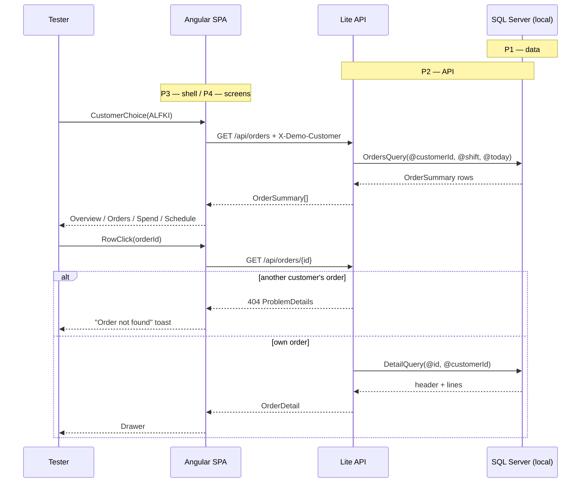
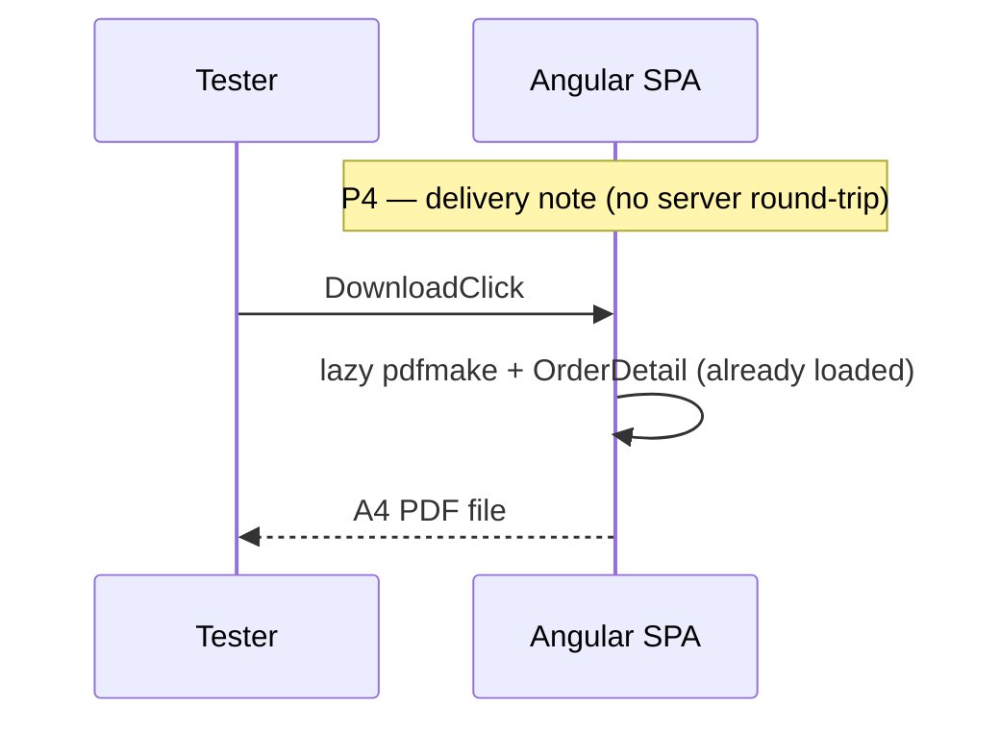
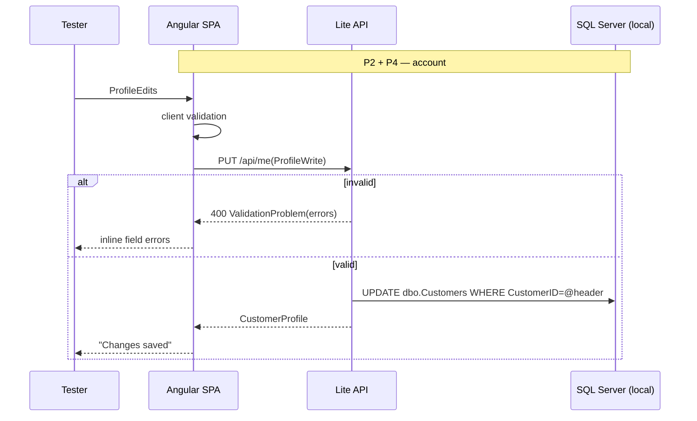

# portal-lite — spec

```yaml
spec: Northwind Customer Portal — Lite (demo build)
context:
  stack: Angular 22 SPA + .NET 10 minimal API + local SQL Server Northwind (throwaway copy)
  goal: visible quality for non-technical judges; invisible architecture deferred to roadmap
  startup: "two terminals: dotnet run (API :5080) and ng serve (SPA :4200, proxy /api -> :5080)"
dependencies:  # all MIT/Apache/OFL — no commercial licence anywhere
  web: [ "@angular/* 22", "@angular/material + cdk 22 (MIT)", "ag-grid-community + ag-grid-angular 35 (MIT)",
         "echarts + ngx-echarts (Apache-2.0)", "@fullcalendar/angular 6.1.x (MIT)",
         "pdfmake (MIT, lazy-loaded)", "@fontsource: big-shoulders-display, ibm-plex-sans, ibm-plex-mono (OFL)" ]
  api: [ "Dapper (Apache-2.0)", "Microsoft.Data.SqlClient (MIT)" ]
  rejected_for_lite: [ Tailwind (overlaps tokens), NSwag, FluentValidation, JWT stack — see roadmap ]

---
phase: P1
component: Local Northwind + query file
requirements:
  - restore: stock Northwind (Microsoft sql-server-samples instnwnd.sql) on the local instance if absent
  - write: db/portal-lite.sql holding the 5 queries the API will run, parameterised by @customerId, @shift, @today
  - derive: status (Shipped | Awaiting dispatch | Late) and order total (sum of UnitPrice*Quantity*(1-Discount)) in SQL
acceptance:
  - given @customerId='ALFKI', when orders query run, then 6 rows with shifted dates, status and total
  - given @customerId='ALFKI' and an OrderID belonging to another customer, when detail query run, then 0 rows
  - given @customerId='FISSA', when orders query run, then 0 rows (empty-state fixture)
  - given the orders query across all customers, then at least one row of each status exists
proof:
  start: "already in place once restored; open SSMS / Azure Data Studio"
  drive: "run each query in db/portal-lite.sql with the parameters above"
  observe: "row counts and statuses as stated; shifted dates fall around 09/2026"
  proves: "data and derived status are right before any code depends on them"

---
phase: P2
component: Lite API
requirements:
  - endpoints:
      GET  /api/customers?search=   -> [{ id, companyName, city, country }]   # max 20, anonymous
      GET  /api/me                  -> CustomerProfile
      PUT  /api/me                  -> CustomerProfile | 400 ValidationProblem
      GET  /api/orders              -> [OrderSummary]  # id, orderedOn, shippedOn?, dueOn, status, itemCount, total, shipTo
      GET  /api/orders/{id}         -> OrderDetail | 404  # header, shipTo, lines[], subtotal, freight, total
  - identity: header X-Demo-Customer on every call except /api/customers; missing -> 401 ProblemDetails
  - scoping: customerId taken from the header only, never from body or route
  - validation: PUT /api/me — contactName required ≤30; phone/fax /^[0-9 +()\-.]{0,24}$/; postalCode ≤10; country required
  - config: ConnectionStrings:Northwind via user-secrets; Portal:DateShiftMonths optional override
  - layout: src/PortalLite.Api — Program.cs + Endpoints/{Customers,Me,Orders}Endpoints.cs + Data/*Queries.cs, one type per file
acceptance:
  - given X-Demo-Customer=ALFKI, when GET /api/orders, then 6 summaries, each with status and total
  - given X-Demo-Customer=ALFKI, when GET /api/orders/{another customer's id}, then 404
  - given no header, when GET /api/me, then 401
  - given PUT /api/me with phone "abc", then 400 with an errors.phone entry
  - given a valid PUT then GET /api/me, then the change is returned
proof:
  start: "dotnet run --project src/PortalLite.Api"
  drive: "run api.http (VS / Rider / VS Code REST client) top to bottom"
  observe: "each response matches the acceptance lines"
  proves: "API serves the phase-1 data with correct scoping"

---
phase: P3
component: Design system and app shell (no API calls)
requirements:
  - tokens: src/styles/tokens.css — every colour, space (4/8 scale), radius, type step; M3 --mat-sys-* mapped
  - themes: 3 brand presets x light/dark as token overrides on [data-brand][data-theme]
  - shell: side rail ≥1024px, top bar, bottom nav <720px; routes stubbed with page headers
  - shared: status-chip, voyage-line (mini|large|hero), skeleton, empty-state, page-header, order-drawer shell
  - route: /styleguide — renders every shared component in every state
acceptance:
  - given the Brand preview menu, when a preset chosen, then colours, wordmark and radius change with no reload
  - given dark mode, then no pure #000/#FFF and all text ≥4.5:1 (checked in each preset with devtools)
  - given 360px viewport, then no horizontal scroll on any stub page
  - given reduced motion enabled, then the voyage line renders without animating
  - given keyboard only, then every control is reachable with a visible focus ring
proof:
  start: "ng serve"
  drive: "open /styleguide; cycle 3 brands x 2 themes; devtools 360px; Tab through"
  observe: "acceptance lines hold on every combination"
  proves: "the visual system is sound before any data flows through it"

---
phase: P4
component: Portal screens wired to API (build order = cut order, bottom first to cut)
requirements:
  - build_order: [ Sign in, Orders + drawer, Delivery note PDF, Overview, Spend, Account, Schedule ]
  - data: one OrdersStore (signals, httpResource) feeds Orders, Overview, Spend and Schedule — one fetch per session
  - http: typed PortalApi service; interceptor adds X-Demo-Customer; errors -> branded toast
  - loading: @defer + skeleton @placeholder for chart and calendar; skeleton for grid
  - pdf: pdfmake loaded on first click; document built from the same OrderDetail the drawer shows
acceptance:
  - given the sign-in page, when ALFKI chosen, then Overview shows ALFKI's name and on-the-water orders
  - given Orders, when a row clicked, then the drawer shows lines and totals matching the row total
  - given the drawer, when Download delivery note clicked, then an A4 PDF downloads whose totals equal the drawer's
  - given Spend, when "Show as table" toggled, then the same monthly figures appear as a table
  - given Account, when phone set to "abc" and saved, then an inline error appears on phone and nothing saves
  - given Account with unsaved edits, when navigating away, then a confirm appears
  - given FISSA signed in, then Orders, Overview and Spend show the designed empty state
  - given a network throttle of "Slow 4G", then skeletons appear, never a blank page or spinner
proof:
  start: "API + ng serve"
  drive: "click through every screen as ALFKI, then FISSA; repeat at 360px"
  observe: "acceptance lines hold"
  proves: "first and only end-to-end pass"

---
phase: P5
component: Demo run-sheet and safety net
requirements:
  - script: plans/demo-run-sheet.md — 7-minute beat sheet (below)
  - reset: db/reset-demo.sql restores ALFKI's customer row to stock values
  - fallback: screen recording of a clean run, saved locally, in case of hardware failure
  beats:
    1: "Sign in as Alfreds — honest demo sign-in (30s)"
    2: "Overview — voyage lines draw; read the sentence header (60s)"
    3: "Orders — search, filter Late, open drawer, download delivery note, open PDF (90s)"
    4: "Spend — chart, then 'Show as table' (accessibility) (45s)"
    5: "Account — trigger an error, fix, save (45s)"
    6: "Brand preview — switch to Alfreds brand, then dark mode: 'every client gets their own portal' (45s)"
    7: "Hand over a phone at 360px / resize window (30s)"
    8: "Close: all MIT/Apache — zero per-developer licence cost (15s)"
acceptance:
  - given a timed rehearsal, when run from reset, then all beats complete in ≤7 minutes with no console errors
proof:
  start: "run db/reset-demo.sql, start both apps"
  drive: "full rehearsal with a stopwatch"
  observe: "≤7 min, no errors"
  proves: "the demo itself works, not just the software"
```

## P6 — Rework after testing (DES, 23/09/2026)

Source: roadmap "Tester Comments" on items 1 and 2. Design settled in
`portal-lite-design.md` → "Revision 2". This phase **extends** P3/P4; it doesn't replace them.

```yaml
phase: P6
component: Orders find/group/filter, grid fixes, sign-out, labelled nav
requirements:
  R1_chip:        # T1 — bundle B1
    - status-chip sets its own line-height (1.25); never inherits the grid cell's
    - grid status cell centres the chip vertically; chip height ≤ 24px, box inside its cell
  R2_columns:     # T2, T4 + date/number findings — bundle B1
    - colIds pinned: orderNo, orderedOn, status, progress, itemCount, total, shipTo
    - header names, in order: Order no, Ordered, Status, Progress, Items, Total, Ship to  # "Voyage" gone
    - headerTooltip per column = design Revision 2 copy table, verbatim
    - Ordered displays DD/MM/YYYY (en-GB, 2-digit day and month, 4-digit year)
    - minWidth so Order no, Ordered, Status, Items, Total never truncate; Items + Total right-aligned
    - tooltips: grid tooltipShowMode 'whenTruncated', tooltipShowDelay 400; every text column's tooltip value = its displayed text
    - header tooltips must always show, but 'whenTruncated' is grid-wide and also suppresses untruncated header tooltips.
      AG Grid skips that header check when colDef.headerComponent is set, so every column sets headerComponent: 'agColumnHeader'
      (the built-in header, named explicitly; sorting UI unchanged). This deviates from the obvious config, so it carries a
      why-not-the-obvious-way comment. Verified by DES against ag-grid-community 35.3 on 23/09/2026.
    - Status and Progress (cell renderers) get no cell tooltip value: in 'whenTruncated' mode AG Grid skips the truncation check
      for renderer cells, so any value there would show on every hover
  R3_find:        # T5 — bundle B1; one pure module feeds both views
    - new file src/app/features/orders/order-view.ts, framework-free, exporting:
        OrderFilters (type), GroupBy = 'none'|'status'|'orderedMonth'|'itemCount'|'shipTo',
        displayedText(order) -> per-column display strings (single source for grid valueFormatters, cards, search, tooltips),
        buildOrderView(orders, { search, filters, groupBy }) -> { groups: OrderGroup[] } where OrderGroup = { key, label, orders, total }
        (groupBy 'none' -> one group, key 'all', whose header is not rendered)
    - search: case-insensitive substring over displayedText of Order no, Ordered, Status, Items, Total, Ship to;
      money also matched with "£" and "," stripped from both sides
    - filters (AND): orderNoContains, orderedFrom/orderedTo (inclusive dates), status, itemsFrom/itemsTo, totalFrom/totalTo (inclusive), shipToContains
    - group order: status Late → Awaiting dispatch → Shipped; orderedMonth newest first, label "September 2026";
      itemCount ascending, label "3 items" / "1 item"; shipTo A–Z; empty groups never emitted
    - orders.ts keeps signals for search/filters/groupBy/collapsed-groups and calls buildOrderView; no filtering logic stays in the component
  R4_grid_groups: # T5 — bundle B1
    - grid rowData = group header rows + order rows, flattened; group rows use isFullWidthRow + a fullWidthCellRenderer
    - group row id: "group:{key}"; order row id: String(order.id) (unchanged)
    - group header: container with data-testid order-group holding exactly one button (aria-expanded) whose text is the whole header: "{label} · {n} order|orders · {formatMoney(total)}"
    - collapsing removes that group's order rows; all groups re-expand when groupBy changes
    - sorting: postSortRows re-partitions sorted rows into the fixed group order, header first — rows sort within groups
  R5_page_header: # T5 — bundle B1
    - order: search (placeholder "Search all columns", testid orders-search kept), Status select (testid orders-status-filter kept, now with a visible label "Status"),
      button "Filters" / "Filters (n)" with aria-expanded + aria-controls (n = filled panel fields, +1 if Status ≠ All; panel date inputs are type="date"), select labelled "Group by" with options None / Status / Ordered month / Items / Ship to
    - Filters panel field labels, exact: Order no contains, Ordered from, Ordered to, Items from, Items to, Total from, Total to, Ship to contains;
      button "Clear filters" resets panel + Status only
    - card view (<720px): same groups as section headings with the same order-group button; same filters and search
    - no-matches: testid orders-no-matches, text "No orders match your search or filters.", button "Clear search and filters" (resets search, panel, Status; not Group by)
    - orders-empty-state ("No orders yet…") only when the customer has zero orders
  R6_sign_out:    # T3 — bundle B1
    - top bar right: "Signed in as {customerId}" + text button "Sign out", visible at 360px and desktop
    - CustomerSession.signOut(): clears storage + signal; OrdersStore drops cached list and selected order
      (the resource must not replay the previous customer's value when the next customer signs in)
    - navigate to /sign-in with replaceUrl
  R7_nav:         # T6 — bundle B2
    - every nav item (bottom nav and side rail) renders a 20px inline SVG icon (aria-hidden) + always-visible text label; accessible name = label
    - icon set drawn now for Overview, Orders, Spend, Schedule, Account; NAV_ITEMS still lists only built pages
    - bottom-nav link hit area ≥ 48px tall; active item: label in --mat-sys-primary + 3px indicator
acceptance:  # each line is one test in the files named under "Bundles"
  B1:
    - given 1280px and SAVEA, every status chip is ≤ 24px tall and inside its cell
    - given 800px and SAVEA, headers read Order no … Ship to in order, no "Voyage"
    - given any header hovered, its tooltip shows the Revision 2 copy
    - given 800px, a truncated Ship to cell hovered shows a tooltip with its full text; an untruncated cell shows none; Total and Order no cells are never truncated
    - given SAVEA, Ordered cells show DD/MM/YYYY matching the API's orderedOn
    - given search by a displayed date, a total (with and without £/commas), a status and a ship-to name, every remaining row contains the term and the source order remains
    - given each Filters field, the rows left equal the API oracle's count under the same rule; Filters (n) counts active fields; Clear filters restores all rows
    - given Group by Status, group headers appear Late → Awaiting dispatch → Shipped with oracle counts and sums; collapsing one hides its rows and sets aria-expanded=false
    - given Group by Status at 390px, the card list shows the same group headers
    - given filters that match nothing, orders-no-matches shows, orders-empty-state does not; Clear search and filters restores rows
    - given Sign out, the URL is /sign-in, /orders redirects to /sign-in, and signing in as ERNSH shows exactly ERNSH's order ids
  B2:
    - given 390px, every bottom-nav link shows its label text and an icon, and is ≥ 48px tall
    - given 1280px, every side-rail link shows its label text and an icon
```

**Bundle impact.** B1 and B2 re-enter at **Waiting for Dev (failed)**. P6 R1–R6
feed B1 and R7 feeds B2. B3–B5 aren't touched, but inherit R7's nav and R6's top bar.

**Rule 3b.** The new pending tests are `e2e/orders-table.spec.ts` (B1) and
`e2e/shell.spec.ts` (B1 sign-out, B2 nav). They read grid DOM through
`e2e/support/grid.ts`, which is the only place allowed to touch AG Grid classes. DEV
removes only the `.skip`. The existing `orders.spec.ts` and `delivery-note.spec.ts`
must keep passing unchanged.

## P7 — Second rework after testing (DES, 23/09/2026)

Source: roadmap "Tester Comments", item 1, second pass (sign out, empty list, filters).
Design: `portal-lite-design.md` → "Revision 3", plus the mockup `docs/plans/mockups/orders-rev3.html`.
P7 **replaces** P6 R5 (page header, filters panel, no-matches) and R6's top-bar
presentation. P6's search rules, grouping, grid and sign-out data safety all stand.

```yaml
phase: P7
component: Orders find surface, account menu, empty states (bundle B1 only)
requirements:
  R8_session:
    - CustomerSession stores { id, companyName } (sessionStorage, same key family); signIn(customer), signOut(), switchTo(customer)
    - switchTo = signOut + signIn in one step: OrdersStore drops cached list and selection before the new id is set (P6 rule stands)
    - sign-in page passes the CustomerSummary / featured card it already has — no new API call
    - FEATURED customers list moves to src/app/core/auth/featured-customers.ts (shared by sign-in and the account menu)
  R9_monogram:
    - shared component src/app/shared/monogram/: input customer {id, companyName}, size 28|32|48
    - initials: first letter of the first two words of companyName (letters only); one word -> first two letters; uppercase
    - fill: stable hash of id (sum of char codes mod 4) over [#1F3A5F, #2F5D3A, #6E2233, #2B5D54]; white text; aria-hidden
  R10_account_menu:
    - trigger in the top bar: button, accessible name "Account: {companyName}", aria-haspopup="menu", aria-expanded;
      ≥720px shows monogram + company name + chevron; <720px monogram only in a 44x44 hit area
    - content component src/app/shell/account-menu/: header (48px monogram, name, "Customer {ID}"), demo note
      "Demo sign-in: switch customer without a password.", group label "Switch to", one menuitem per featured customer
      except the current one (name = company name), menuitem "Choose another customer…", separator, menuitem "Sign out"
    - host: @angular/cdk/menu (cdkMenuTriggerFor) ≥720px; MatBottomSheet containing the same cdkMenu <720px
    - switching lands on /orders and shows snackbar "Now viewing {companyName}"; sign out lands on /sign-in (replaceUrl) with snackbar "Signed out of {companyName}"
    - "Choose another customer…" = sign out without the snackbar, then /sign-in
    - the old "Signed in as" text and the bare Sign out button are removed
  R11_toolbar:
    - search: type=search pill, testid orders-search kept, magnifier icon, clear button "Clear search" when non-empty
    - status: radiogroup named "Status", radios in order All, Late, Awaiting dispatch, Shipped; accessible name "{label} {count}";
      counts = orders matching search + filters (not status); the old select and testid orders-status-filter are removed
    - Filters trigger: accessible name "Filters" or "Filters ({n})", n = active chip count; aria-expanded + aria-controls;
      ≥720px pill with icon, label and badge; <720px 44px round icon button with badge
    - Group by: ≥720px native select labelled "Group by" dressed as a pill; <720px only inside the Filters sheet
  R12_filters_surface:
    - one component src/app/features/orders/order-filters/ (sections + footer); hosts: CDK connected overlay ≥720px (role dialog, non-modal),
      MatBottomSheet <720px (role dialog, aria-modal, name "Filters", focus returns to the trigger on close)
    - live apply; footer: "Clear filters" (resets sections only) and primary "Show {n} order(s)" (closes; n = live result count)
    - sections, labels exact:
        Group by (<720px only): radiogroup "Group by" — None, Status, Ordered month, Items, Ship to
        Ordered: radiogroup "Ordered" — Any time, Last 30 days, Last 3 months, Last 12 months, Custom dates;
                 Custom dates reveals date inputs "Ordered from", "Ordered to" (inclusive)
                 presets: orderedOn >= today minus 30 days | minus 3 calendar months | minus 12 calendar months (browser local date)
        Total: hint "{k} of your {N} orders fall in this range."; histogram data-testid total-histogram with 16 bars (data-testid total-histogram-bar,
               data-count, data-in-range="true|false"; a bar is in range when its midpoint lies within [from, to], open ends unbounded) over £0..ceil500(max total) — bar index = min(15, floor(total ÷ (top ÷ 16))) — counting orders matching everything except Total;
               range inputs "Minimum total" / "Maximum total" (step 50); money inputs "Total from" / "Total to" kept in sync; extremes = no limit
        Items: numeric inputs "Items from" / "Items to" (empty = Any) with buttons "Decrease Items from", "Increase Items from", "Decrease Items to", "Increase Items to"
        Order no: text input "Order no contains"
        Ship to: ≥2 distinct shipTo -> checkbox per name (accessible name = the ship-to name) with its count; else text "All your orders go to {name}."
    - order-view.ts OrderFilters changes: orderedPreset ('any'|'30d'|'3m'|'12m'|'custom'), shipTo: string[] replaces shipToContains; status stays in the model
    - new pure functions in order-view.ts: activeFilterChips(filters, today) -> { key, text }[] (text per design copy, exactly), histogram(orders, filters) -> bins
  R13_chips:
    - row under the toolbar when ≥1 chip, data-testid active-filters; chips in section order (Ordered, Total, Items, Order no, Ship to); each chip's remove button named "Remove filter: {text}"; "Clear all" button when ≥2 chips
  R14_empty_states:
    - no orders: toolbar hidden (no search, tabs, filters, group); card data-testid orders-empty-state with heading "No orders yet",
      body per design (company name inserted), button "Choose another customer" -> /sign-in; ghost voyage drawing aria-hidden; hull bob off under reduced motion
    - nothing matches: data-testid orders-no-matches; heading "No orders match “{search}”" when search set, else "No orders match these filters";
      body per design; the chips (plus "Search {term}" chip when searching); primary button "Clear search and filters" resets search, filters and status (not Group by)
  R15_grid_alignment:
    - Items and Total cells and headers right-aligned (text-align: right), mono — P6 R2 requirement not yet met
  R16_tokens_motion:
    - tokens per design Revision 3 table; motion per design (transform/opacity only; none under prefers-reduced-motion)
acceptance:  # one test each, files under "Bundles"
  - given the phone and desktop top bar, the account trigger is named "Account: {companyName}"; there is no "Signed in as" text
  - given the account menu, it lists the other featured customers, "Choose another customer…" and "Sign out" as menu items
  - given a switch to Alfreds from the menu, the URL is /orders, the toast reads "Now viewing Alfreds Futterkiste", and only ALFKI's orders ever render
  - given Sign out from the menu, the URL is /sign-in, /orders redirects to sign-in, and the toast reads "Signed out of {companyName}"
  - given status tabs, their counts equal the oracle under the current search, and choosing Late shows only Late orders
  - given each Filters section, the rows equal the oracle; chips read exactly per design; Filters ({n}) counts chips; removing a chip restores rows
  - given the Total histogram, bar counts sum to the orders matching the other filters, and in-range bars match the Total from/to values
  - given the phone, Filters opens a modal dialog named "Filters" whose "Show {n} orders" button shows the live count and closes it
  - given ALFKI, the Ship to section offers a checkbox per ship-to name; given SAVEA, it states the single destination
  - given FISSA, the toolbar is absent and "Choose another customer" leads to sign-in
  - given a search that matches nothing, the heading quotes the search and Clear search and filters restores every order and status All
  - given desktop, Items and Total cells are right-aligned
```

**Bundle impact.** P7 feeds **B1** only. B2's nav fix passed, so leave it alone.

**Rule 3b.** DES has updated the B1 tests to this contract:
- `e2e/orders.spec.ts`: the status select becomes the tabs;
- `e2e/orders-table.spec.ts`: filters, chips and no-matches follow the new UI;
- `e2e/shell.spec.ts` "sign out (B1)": now the account menu.

The new pending file is `e2e/orders-find.spec.ts`. DEV removes only the `.skip` markers.

```yaml
---
phase: P8
component: Shell layout, status tracker, toolbar surfaces (bundle B1 only) — design Revision 4
requirements:
  R17_nav_breakpoint:
    - bottom nav shows below 1024px, side rail at >=1024px; exactly one visible at any width (shell CSS splits the nav on 1024px only)
    - PHONE_QUERY (719px) is unchanged: sheets vs popovers and cards vs grid still split at 720px
    - new token --bottom-nav-height: 56px; content clears it whenever the bottom nav shows
  R18_sticky_and_fit:
    - new token --top-bar-height: 64px; the top bar is exactly that high, position sticky, top 0, on every page and width
    - z-index: the top bar sits above page content (AG Grid headers included) and below CDK overlays, bottom sheets and the order drawer; one small scale in tokens.css, no magic numbers
    - side rail: position sticky, top 0, height 100dvh
    - Orders at >=720px: the page is a flex column whose height is 100dvh minus --top-bar-height, minus --bottom-nav-height below 1024px;
      header, toolbar and chips are flex none; the grid view is flex 1 with min-height 240px; the old calc(100vh - 200px) is removed
    - phone (<720px) keeps normal page scroll under the sticky top bar
  R19_rail_spacing:
    - side-rail links stretch to the full rail width; the 3px indicator stays the link's inline-start border; icon and label centred
  R20_status_tracker:
    - new shared component src/app/shared/status-tracker/: inputs status (OrderStatus), size 'compact' | 'large'
    - DOM contract: root data-testid status-tracker with data-status="{status}"; three stops data-testid status-tracker-stop,
      data-state done|current|todo per the design table; label data-testid status-tracker-label containing exactly the status text;
      the drawing is aria-hidden, the label is plain text
    - icons: receipt (stop 1), clock or warning when Late (stop 2), ship (stop 3); drawn in src/app/shared/icon/ alongside the existing ones
    - sizes, colours and label alignment exactly per design Revision 4 (compact 20px stops, large 32px; label centred under stop 2, end-aligned under stop 3)
    - grid: one column colId status, headerName Status, cell renderer = the tracker (compact), minWidth 168, rowHeight 52;
      comparator ranks Late < Awaiting dispatch < Shipped; the Progress column and colId progress are removed
    - HEADER_TOOLTIPS.status = "Each order moves from Ordered, to Awaiting dispatch, to Shipped. Late means it hasn't shipped and is past its due date."; the progress entry is removed
    - phone card: the tracker (compact) replaces app-status-chip and app-voyage-line; data-order-id and existing testids unchanged
    - search text for status is unchanged (the status word)
  R21_drawer:
    - the large tracker replaces the large voyage line
    - under it a definition list: Ordered / Shipped / Due, values DD/MM/YYYY; Shipped shows "Not yet" when shippedOn is null;
      value testids order-drawer-ordered, order-drawer-shipped, order-drawer-due
  R22_control_font:
    - styles.css base rule: button, input, select, textarea inherit font (font: inherit); remove per-component font resets it makes redundant only in files this phase already touches
  R23_popover_surface:
    - one global class .popover-surface in styles.css: surface background, 14px radius, --shadow-float, 160ms fade + 4px rise (none under reduced motion);
      it owns the single @keyframes; the copies in orders.css and app-shell.css are deleted
    - every desktop pop-up root carries class popover-surface and data-testid popover-surface: Filters popover, Group by menu, account menu
    - Filters overlay: cdkConnectedOverlayFlexibleDimensions true, cdkConnectedOverlayViewportMargin 16, positions below (end-aligned) then above as fallback;
      the surface is a flex column with max-height min(70vh, 100%) of the overlay pane; the filters head and footer are flex none; only the body scrolls
  R24_group_by_menu:
    - >=720px: the native select and id orders-group-by are removed; a button styled with the Filters pill's class, content: group icon,
      "Group by" (secondary ink), the current option label (600), chevron (rotates 180deg while open, 160ms, none under reduced motion)
    - accessible name starts "Group by" and includes the current label; aria-haspopup menu; aria-expanded (from CdkMenuTrigger)
    - menu: CdkMenu with aria-label "Group by", five CdkMenuItemRadio items (None, Status, Ordered month, Items, Ship to) with aria-checked
      and a tick icon on the checked one; min-width 200px; right-aligned under the pill, 8px gap (same ConnectedPosition as the account menu — share the constant)
    - choosing applies filterState.setGroupBy and closes; Esc closes and focus returns to the pill
    - <720px unchanged (radiogroup in the Filters sheet)
  R25_cleanup:
    - delete StatusCellRenderer, VoyageCellRenderer and the StatusChip component once nothing imports them; VoyageLine stays (sign-in page, and B3's Overview)
acceptance:  # one test each, files under "Bundles"
  - given widths 390–1280 incl. 719/720/1023/1024, exactly one Primary nav is visible and its Orders link shows
  - given phone, tablet and desktop, after scrolling to the bottom the top bar is fully on screen at the top and the nav is visible
  - given desktop Orders at 1280x800, 1280x600 and 800x700 with a status tab chosen, the page does not scroll, the grid is fully on screen and clear of the nav
  - given the side rail, the Orders link spans the rail and its label is >=12px right of the 3px indicator
  - given the grid, each order's tracker carries its status, the right stop states, and the status name uncut inside the cell
  - given Status sorted, rows run Late, Awaiting dispatch, Shipped
  - given the phone card list, each card shows the tracker and no chip or route line
  - given the drawer, the tracker plus Ordered, Shipped (or "Not yet") and Due dates match the API
  - given the grid headers, they read Order no, Ordered, Status, Items, Total, Ship to, and each shows its tooltip copy
  - given the Filters and Group by pills, their font family, size, weight, spacing and line height match, and equal the body font
  - given a desktop window 520, 600 or 800px high, the Filters panel's Clear filters and Show buttons are fully on screen, including after scrolling to its last section
  - given the Group by pill, it opens a "Group by" menu of five radio items with the current one checked; picking closes it and relabels the pill; Esc returns focus
  - given Group by, Filters and the account menu, their surfaces share background, radius and shadow
  - given the account menu on a phone, the trigger reports aria-expanded="true" while the sheet is open (test locates it by label; see design Revision 4 Stage 3)
```

**Bundle impact.** P8 feeds **B1** only. B2's nav-label test (`e2e/shell.spec.ts` "navigation is labelled (B2)") must keep passing unchanged; the bottom nav's look doesn't change, only the width it shows at.

**Rule 3b.** DES has written or updated, all pending (`.skip`):
- new: `e2e/shell-layout.spec.ts` (R17–R19), `e2e/status-tracker.spec.ts` (R20–R21), `e2e/orders-toolbar.spec.ts` (R22–R24);
- updated to this contract: `e2e/orders-table.spec.ts` (tracker cell test replaces the chip test; header names and tooltips; the three Group by tests now use the menu), `e2e/support/grid.ts` (`progress` column id removed);
- `e2e/shell.spec.ts` "account menu (B1)": `openAccountMenu` now finds the trigger by label after opening, so the phone half can pass. The assertion is unchanged.

DEV removes only the `.skip` markers. Every other test in the suite must stay green.

## Bundles (tester-testable units → roadmap items)

| Bundle | Phases | Test file (Playwright, pending) |
|---|---|---|
| B1 Sign in and browse my orders | P1–P4 (sign in, orders, drawer) + P6 R1–R4 + P7 R8–R16 + P8 R17–R25 | e2e/orders.spec.ts, e2e/orders-table.spec.ts, e2e/orders-find.spec.ts, e2e/shell.spec.ts (account), e2e/shell-layout.spec.ts, e2e/status-tracker.spec.ts, e2e/orders-toolbar.spec.ts |
| B2 Download a delivery note | P4 (pdf) + P6 R7 | e2e/delivery-note.spec.ts, e2e/shell.spec.ts (nav labels) |
| B3 See spend and schedule | P4 (overview, spend, schedule) | e2e/spend-schedule.spec.ts |
| B4 Edit my account details | P2 PUT, P4 account | e2e/account.spec.ts |
| B5 Switch brand and dark mode | P3 | e2e/branding.spec.ts |

## Reachability

| Affordance | Introduced | Backing capability | Lands |
|---|---|---|---|
| Customer picker | P4 | GET /api/customers | P2 |
| Orders grid / cards | P4 | GET /api/orders | P2 |
| Order drawer | P4 | GET /api/orders/{id} | P2 |
| Download delivery note | P4 | OrderDetail + pdfmake | P2 / P4 |
| Overview, Spend, Schedule | P4 | OrdersStore over GET /api/orders | P2 / P4 |
| Save changes (Account) | P4 | PUT /api/me | P2 |
| Brand preview, dark mode | P3 | tokens.css presets | P3 |

No violations.

## Swim lanes







## Tests (Rule 3b)
- DES writes the 5 Playwright files above as pending, before P4.
- The repo doesn't exist yet, so they land as the first commit after `ng new`.

## Test contract for B2–B5 (DES, 23/09/2026)

The four pending files above now exist. They pin these hooks and copy; DEV builds to them and never edits the tests (Rule 3b). Anything here that turns out wrong is a spec gap — stop and hand back to DES.

Shared: `e2e/support/portal.ts` (sign-in, nav, API oracle), `e2e/support/pdf.ts` (reads PDF text/page size via `pdfjs-dist`, devDependency, Apache-2.0), `e2e/support/a11y.ts` (contrast, pure-colour, motion, keyboard checks — each self-checked against planted faults before commit).

| Bundle | Routes | Test ids | Roles / copy |
|---|---|---|---|
| B2 | — | `order-drawer-freight` (drawer freight amount) | button "Download delivery note"; file `delivery-note-{id}.pdf`; A4 portrait; PDF text contains `#{id}`, "Delivery note", "Received by", every line amount, freight and total formatted exactly as the drawer shows them |
| B3 | `/overview`, `/spend`, `/schedule` | `overview-sentence`, `on-the-water-order` + `data-order-id`, `spend-chart`, `spend-table`, `spend-table-row` + `data-month="YYYY-MM"`, `spend-table-amount`, `schedule-event` + `data-order-id`, `overview-empty-state`, `spend-empty-state`, `skeleton` (on the shared skeleton) | nav links "Overview", "Spend", "Schedule"; Overview `h1` contains company name; sentence contains "{n} late"; switch "Show as table" hides the chart and shows 12 rows, current month last; schedule opens on the current month and clicking an entry opens the shared order drawer; no `progressbar` while loading |
| B4 | `/account` | — | nav link "Account"; labels "Company name" (read-only), "Phone"; button "Save changes"; toast "Changes saved"; phone error "Phone can only contain digits, spaces, +, ( ) and -" wired as the field's accessible description with `aria-invalid="true"`; no PUT sent when client validation fails; leave-guard dialog "Discard unsaved changes?" with buttons "Keep editing" / "Discard changes", shown only when dirty; API: `GET /api/me` 401 without header, `PUT /api/me` 400 with `errors.phone` |
| B5 | `/styleguide` (inside the shell) | `wordmark` (exactly one element, in the top bar), `voyage-line` (on the shared voyage line) | button "Brand preview" opens `menuitemradio` items "Northwind" / "Alfreds Futterkiste" / "Ernst Handel" with `aria-checked`; `<html data-brand="northwind|alfreds|ernst">`; radiogroup "Theme" with radios Light / Dark / System visible in the header at phone width; `<html data-theme="light|dark">` (System follows the device live); light `--mat-sys-primary` = #1F3A5F / #2F5D3A / #6E2233; `--mat-sys-corner-medium` differs per brand; text ≥4.5:1 on every signed-in page in all 6 combinations; no pure #000/#FFF painted in dark; no sideways scroll at 360px; Overview voyage lines animate on load except under reduced motion; every Tab stop on `/orders` and `/account` reachable with a visible focus change |

Decisions settled here so DEV doesn't have to:
- Test data: B4 edits **BLAUS**, never a demo customer, and restores its row afterwards. B3's overview/schedule checks use **ERNSH** (has late orders and current-month entries).
- Spend's 12-month window is the current calendar month plus the 11 before it; empty months show £0.00 rather than being dropped.
- Sign-in still lands on `/orders` (B1's test pins that); Overview is reached from the nav.
- Brand and theme don't need to persist across reloads; the tests re-pick them per page.

### Pre-existing, not fixed here
- `e2e/orders.spec.ts` (B1) keeps its own copies of `parseMoney`/`signInAs`, now duplicated in `e2e/support/portal.ts`. Left alone because B1 is awaiting release.
- The shell's side-rail wordmark ("NW") and top-bar wordmark are two elements; B5 needs only the top-bar one to carry `data-testid="wordmark"`.
- (Found 23/09/2026, P6 verification.) `scripts/dev-setup` installs Node 22.22.2, but Angular CLI 22 needs ≥ 22.22.3, so `ng serve` and Playwright's webServer refuse to start on a fresh setup. DES verified P6 on Node 22.22.3.
- (Found 23/09/2026.) The cloud environment's `MSSQL_SA_PASSWORD` fails SQL Server's complexity rule, so `setup.sh` stops at preflight until a stronger value is set.
